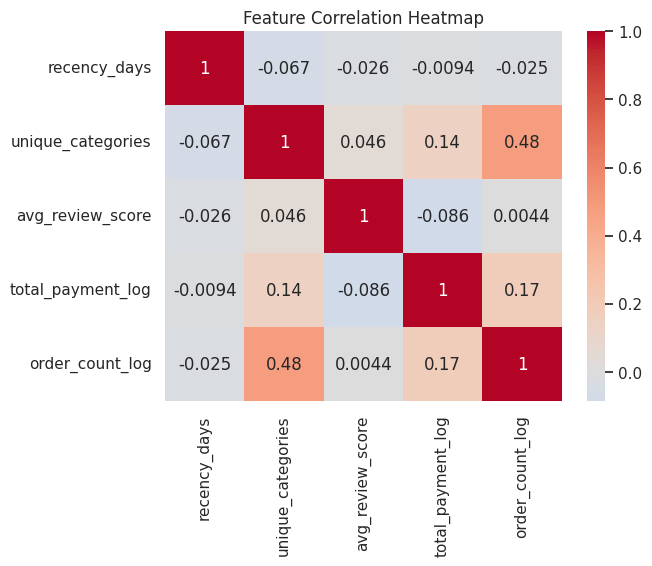
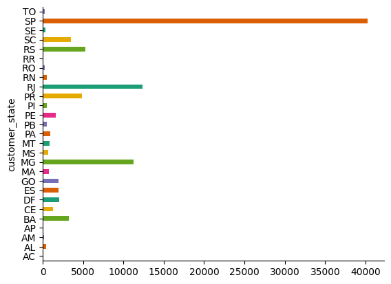

# Data-Driven Customer Segmentation in Brazilian E-Commerce: Insights from RFM and K-Means Clustering

## 📌 Overview
This project analyzes a comprehensive Brazilian e-commerce dataset to uncover patterns in customer purchasing behavior, loyalty, and satisfaction. By integrating multiple data sources and engineering features like recency, frequency, monetary value (RFM), product diversity, and review sentiment, we segment customers using advanced clustering techniques. The findings provide actionable insights for targeted marketing, retention strategies, and enhanced customer experience.

---

## 📊 Key Visualizations and Insights

### 1. **Feature Correlation Heatmap**
  
**Insights:**
- **Recency Days** shows weak negative correlations with other features, indicating it is largely independent of order frequency, spending, or satisfaction.
- **Unique Categories and Order Count Log** have the strongest positive correlation (0.48), suggesting frequent buyers also purchase from diverse categories.
- **Average Review Score** has negligible correlation with other features, implying satisfaction is not strongly linked to purchasing behavior.

---

### 2. **Customer Distribution by State**
  
**Insights:**
- **São Paulo (SP) dominates**, with over 40,000 customers—far surpassing other states.
- **Rio de Janeiro (RJ) and Minas Gerais (MG)** also have significant customer bases.
- **Regional disparities** are evident, with fewer customers in North and Northeast Brazil.  
**Implication:** Marketing and logistics should prioritize densely populated regions like SP, RJ, and MG.

---

### 3. **Average Review Score Distribution**
  
**Insights:**
- **Strong skew toward high scores:** Most customers rate their experience as 5/5.
- **Few dissatisfied customers:** Very few average scores fall below 3.  
**Implication:** High satisfaction is a strength, but addressing minor issues can further improve loyalty.

---

### 4. **Order Count per Customer**
  
**Insights:**
- **Majority are one-time buyers:** Most customers place only one order.
- **Sharp decline for repeat purchases:** Few customers make multiple purchases.  
**Implication:** Retention strategies (e.g., loyalty programs) are critical to encourage repeat business.

---

### 5. **Payment Method Mix**
  
**Insights:**
- **Credit cards dominate**, used by over 70% of customers.
- **Boleto and vouchers** are secondary options.  
**Implication:** Credit card convenience is key, but offering diverse payment methods can cater to all segments.

---

### 6. **Log Total Customer Spend**
  
**Insights:**
- **Approximately normal distribution:** Most customers spend moderately.
- **Long right tail:** A small group of high spenders contributes disproportionately to revenue.  
**Implication:** High-value customers should be identified and retained through personalized offers.

---

### 7. **Recency (Days Since Last Purchase)**
.png)  
**Insights:**
- **Wide range of recency:** Some customers are recent, while others haven’t purchased in over 700 days.
- **Declining trend:** Fewer customers remain active as time passes.  
**Implication:** Re-engagement campaigns can win back lapsed customers.

---

### 8. **Total Payment vs. Review Score**
  
**Insights:**
- **No strong correlation:** Spending levels don’t predict satisfaction.
- **High scores across all spending levels:** Satisfaction is consistent.  
**Implication:** Service quality should be maintained uniformly for all customer segments.

---

### 9. **Elbow Method for Optimal Clusters**
  
**Insights:**
- **Elbow point at k=3 or k=4:** Suggests these cluster counts balance interpretability and granularity.  
**Implication:** Segmentation should use 3-4 clusters for meaningful groupings.

---

### 10. **PCA Projection of Customer Segments**
#### Unclustered Data
.png)  
**Insights:**  
- Data forms distinct vertical bands, hinting at underlying structure.

#### K-Means Clustering
  
**Insights:**  
- Clear separation of 3 clusters, each with distinct behaviors.

#### Hierarchical Clustering
  
**Insights:**  
- More granular segmentation (5 clusters) captures nuanced customer profiles.

---

### 11. **Spending Velocity by Cluster**
  
**Insights:**
- **Cluster 4** has significantly higher spending velocity.  
**Implication:** Target high-velocity clusters with retention and upsell strategies.

---

### 12. **Hierarchical Clustering Dendrogram**
.png)  
**Insights:**  
- Truncated view shows major merges and cluster sizes.  
**Implication:** Cutting the dendrogram at a chosen height reveals optimal cluster count.

---

## 🔍 Key Findings
1. **One-time buyers dominate**, highlighting retention opportunities.
2. **High-value customers** (though few) drive revenue—focus on loyalty programs.
3. **Regional concentration** in SP, RJ, and MG suggests targeted marketing.
4. **High satisfaction overall**, but minor improvements can enhance loyalty.
5. **Clustering validated** 3-5 segments as optimal for actionable insights.

---

## 🛠️ Tools and Techniques
- **Data Preprocessing:** Pandas for cleaning, merging, and feature engineering.
- **Clustering:** K-Means, Hierarchical, DBSCAN, HDBSCAN.
- **Visualization:** Matplotlib, Seaborn, PCA, UMAP.
- **Analysis:** RFM (Recency, Frequency, Monetary), correlation heatmaps, hypothesis testing.

---

## 📚 References
1. [Olist Brazilian E-Commerce Dataset](https://www.kaggle.com/datasets/olistbr/brazilian-ecommerce)  
2. [From Data to Viz](https://www.data-to-viz.com/)  
3. *Storytelling with Data* by Cole Nussbaumer Knaflic  

---

## 🎯 Conclusion
This project empowers e-commerce businesses to:
- **Target high-value segments** with personalized strategies.
- **Optimize regional efforts** in key states like SP, RJ, and MG.
- **Enhance retention** by addressing one-time buyers.
- **Maintain high satisfaction** while improving minor pain points.  

By leveraging these insights, businesses can drive growth in Brazil’s dynamic e-commerce market.